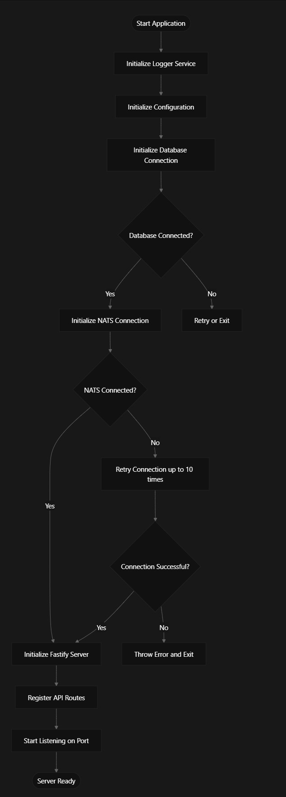
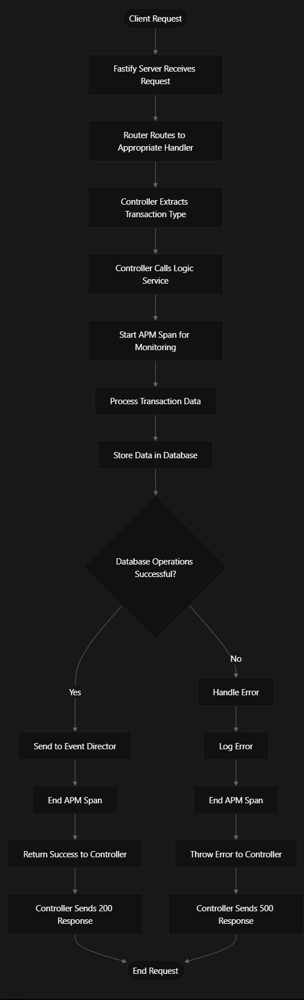
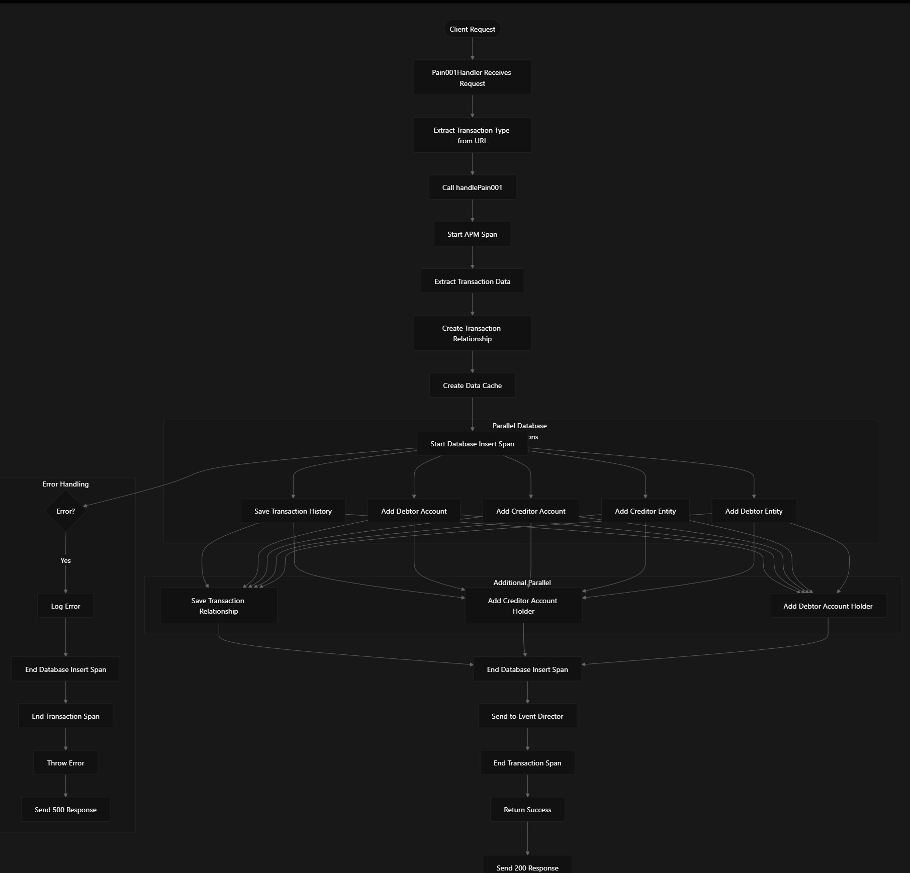
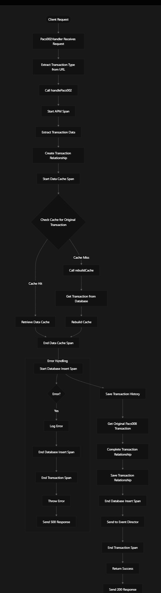
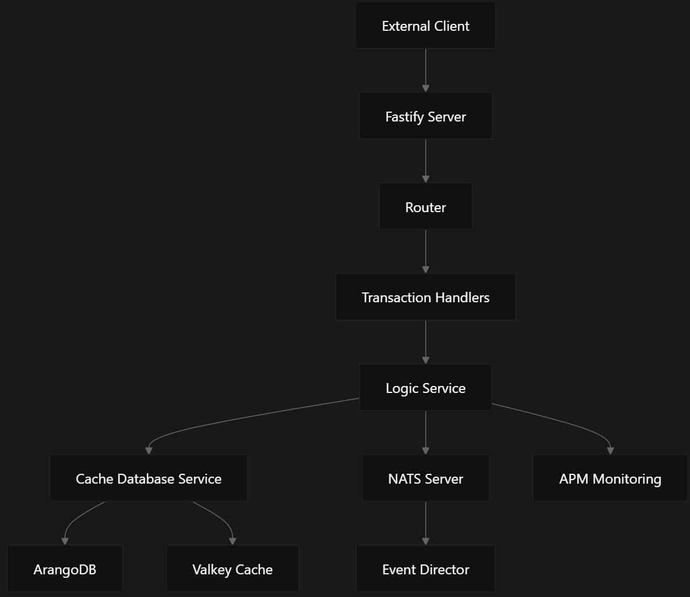

<!--
Documentation research and outputs by LexTego Ltd.
Licensed under the Creative Commons Attribution-ShareAlike 4.0 International License.
See: https://creativecommons.org/licenses/by-sa/4.0/
-->
# Detailed Process Flow for EMMA Event Monitoring API

Based on the codebase, I'll create a detailed process flow for the EMMA Event Monitoring API (Transaction Monitoring Service - TMS), which handles ISO20022 financial transaction messages.

## Application Initialization Flow

## Transaction Processing Flow

The application processes four types of ISO20022 messages:

* Pain.001.001.11 (Customer Credit Transfer Initiation)
* Pain.013.001.09 (Creditor Payment Activation Request)
* Pacs.008.001.10 (Financial Institution to Financial Institution Customer Credit Transfer)
* Pacs.002.001.12 (Payment Status Report)

## General Transaction Processing Flow

## Pain.001 Processing Flow

## Pacs.002 Processing Flow (with Cache)

## Component Interactions

## Key Components and Their Roles

1. Fastify Server: Handles HTTP requests and responses
1. Router: Defines API endpoints for different transaction types
1. Transaction Handlers: Process incoming requests and call appropriate logic services app.controller.ts:7-33
1. Logic Service: Contains business logic for processing different transaction types logic.service.ts:15-22
1. Cache Database Service: Manages data persistence in ArangoDB and Valkey Cache
1. NATS Server: Messaging system for communicating with Event Director logic.service.ts:102-109
1. APM Monitoring: Application Performance Monitoring for tracking performance logic.service.ts:18

## Transaction Types and Their Processing

The application handles four types of ISO20022 messages, each with its own processing flow:

1. Pain.001.001.11 (Customer Credit Transfer Initiation):
   * Processes customer-initiated credit transfers
   * Stores transaction data, accounts, entities, and relationships
   * Notifies Event Director logic.service.ts:15-114
1. Pain.013.001.09 (Creditor Payment Activation Request):
   * Processes creditor-initiated payment requests
   * Similar flow to Pain.001 but with different data structure logic.service.ts:116-207
1. Pacs.008.001.10 (FI to FI Customer Credit Transfer):
   * Processes transfers between financial institutions
   * Stores transaction data with additional fields for exchange rates logic.service.ts:209-272
1. Pacs.002.001.12 (Payment Status Report):
   * Processes payment status reports
   * Requires retrieving original transaction data from cache or database logic.service.ts:333-426

## Error Handling Flow

## Notes

* The application uses parallel processing (Promise.all) to optimize database operations
* APM spans are used to monitor performance at different stages of processing
* Error handling is comprehensive with proper logging and cleanup
* The system integrates with external services like Event Director via NATS
* Configuration options like QUOTING determine which transaction types are supported
* The README indicates this is part of the Tazama Transaction Monitoring Service