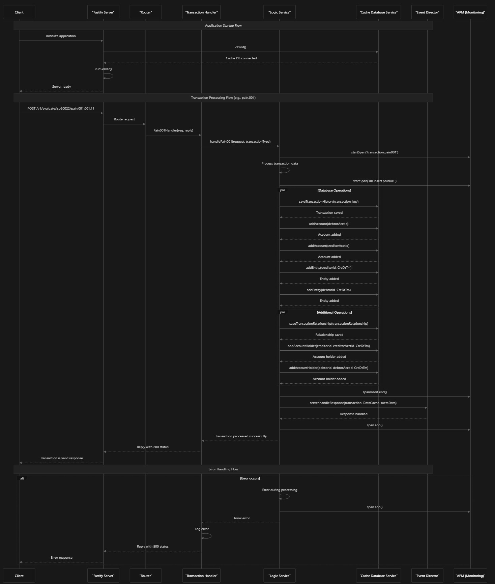

<!--
Documentation research and outputs by LexTego Ltd.
Licensed under the Creative Commons Attribution-ShareAlike 4.0 International License.
See: https://creativecommons.org/licenses/by-sa/4.0/
-->
# Detailed Sequence Diagram of EMMA Event Monitoring API

Based on the code analysis, I'll provide a detailed sequence diagram of the EMMA event monitoring API, which processes various types of ISO20022 financial transactions.

## Sequence Diagram

## Explanation of Key Components

1. Application Initialization:
   * The application starts in index.ts by initializing the database connections index.ts:19-24
   * Then it establishes connections to the messaging service and starts the Fastify server index.ts:26-52
2. Request Handling:
   * Router defines endpoints for different transaction types router.ts:15-24
   * Controllers handle the incoming requests and extract transaction data app.controller.ts:7-33
1. Transaction Processing:
   * Logic service processes various transaction types (pain001, pain013, pacs008, pacs002) logic.service.ts:15-114
   * Each transaction type has specific logic for extracting and processing fields
2. Data Storage:
   * The CacheDatabaseService handles data persistence cache-database.ts:92-105
   * Transactions are stored in both a database and Redis cache cache-database.ts:116-139
3. Event Notification:
   * After processing, transactions are sent to an event-director service logic.service.ts:102-110
4. Error Handling and Monitoring:
   * APM (Application Performance Monitoring) spans track performance logic.service.ts:18
   * Comprehensive error handling with logging logic.service.ts:85-98

## Notes

* The diagram focuses on the happy path of processing a pain.001 transaction, but the system handles multiple transaction types with similar flows.
* The actual implementation includes detailed error handling, logging, and performance monitoring.
* The system uses a cluster setup for horizontal scaling as seen in the primary code.
* Database operations are performed in parallel where possible to optimize performance.
* The API integrates with external systems like the event director for further processing of transactions.
