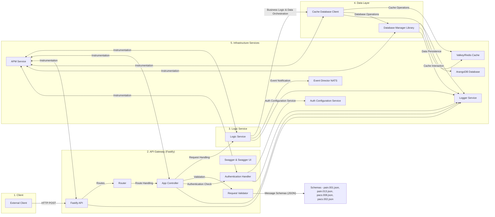

<!--
Documentation research and outputs by LexTego Ltd.
Licensed under the Creative Commons Attribution-ShareAlike 4.0 International License.
See: https://creativecommons.org/licenses/by-sa/4.0/
-->
## Analysis

## Architecture Diagram Explanation:

The diagram illustrates a layered architecture for the Transaction Monitoring Service (TMS). Here's a breakdown of each layer and component:

**1. Client Layer:**

*   **External Client:** Represents any external system or application that sends ISO 20022 messages (Pain001, Pain013, Pacs008, Pacs002) to the TMS for evaluation.

**2. API Gateway Layer (Fastify):**

*   **Fastify API (API):** The entry point of the TMS, built using the Fastify framework. It handles incoming HTTP requests.
*   **Router:**  Responsible for routing incoming requests to the appropriate controllers based on the URL path (`src/router.ts`).
*   **App Controller (Controller):** (`src/app.controller.ts`)  Handles request-specific logic, delegates processing to the Logic Service, and prepares HTTP responses. It contains handlers for each transaction type (Pain001Handler, Pain013Handler, Pacs008Handler, Pacs002Handler) and health checks.
*   **Swagger & Swagger UI:**  Integrates Swagger for API documentation and interactive exploration (`src/clients/fastify.ts`).
*   **Request Validator (Validator):** Uses JSON schemas (`src/schemas/*.json`) to validate the format and structure of incoming HTTP requests, ensuring data integrity before processing.
*   **Schemas (Schemas):**  JSON schema files (pain.001.json, pain.013.json, pacs.008.json, pacs.002.json) define the expected structure of each ISO 20022 message type.
*   **Authentication Handler (AuthHandler):** (`src/auth/authHandler.ts`)  Handles API authentication by validating tokens in the `Authorization` header, if authentication is enabled in the configuration.

**3. Logic Service Layer:**

*   **Logic Service (Logic):** (`src/logic.service.ts`) Contains the core business logic for processing each transaction type (handlePain001, handlePain013, handlePacs008, handlePacs002, rebuildCache). It orchestrates data retrieval, processing, and storage, and interacts with the Data Layer and Event Director.

**4. Data Layer:**

*   **Cache Database Client (CacheClient):** (`src/clients/cache-database.ts`)  Provides an abstraction layer for interacting with both the cache (Valkey/Redis) and the persistent database (ArangoDB). It wraps the `Database Manager Library` and adds caching capabilities.
*   **Database Manager Library (DBManager):** (`@tazama-lf/frms-coe-lib`) A reusable library that handles the low-level interactions with the underlying databases (Valkey/Redis and ArangoDB).

**5. Infrastructure Services Layer:**

*   **Valkey/Redis Cache (Cache):**  Used for caching transaction data and improving performance, especially for Pacs002 message processing where retrieving Pacs008 data from cache is crucial.
*   **ArangoDB Database (ArangoDB):**  A persistent database used to store transaction history, account information, entity details, and transaction relationships.
*   **Event Director (NATS) (EventDirector):**  An event streaming platform (using NATS) to which the TMS publishes processed transactions. This allows other services (like risk engines or dashboards) to consume and react to transaction events.
*   **Logger Service (Logger):** (`@tazama-lf/frms-coe-lib` and `src/index.ts`)  A centralized logging service used by all components to record events, errors, and debug information.
*   **APM Service (APMService):** (`src/apm.ts` and `@tazama-lf/frms-coe-lib`)  Application Performance Monitoring service used to track performance metrics, trace requests, and monitor the health of the TMS application.
*   **Auth Configuration Service (AuthConfig):**  An external service (likely part of the `@tazama-lf/auth-lib`) that provides authentication configurations, such as public keys for token validation.

**Data Flow and Interactions:**

1.  **Request Ingress:**  External clients send ISO 20022 messages via HTTP POST requests to the Fastify API.
2.  **Routing and Validation:** The Router directs requests to the appropriate Controller. The Validator, using JSON Schemas, validates the request body.
3.  **Authentication:** If enabled, the Authentication Handler verifies the token in the request.
4.  **Logic Processing:** The Controller delegates the transaction processing to the Logic Service, which handles the business logic specific to each transaction type.
5.  **Data Access:** The Logic Service interacts with the Cache Database Client to store and retrieve data from both the cache and the persistent database (ArangoDB) via the Database Manager Library.
6.  **Event Notification:** After processing, the Logic Service sends a notification message to the Event Director (NATS) to inform other services about the processed transaction.
7.  **Logging and Monitoring:** All components utilize the Logger Service for logging, and the APM Service for performance monitoring and tracing.

This diagram provides a high-level overview of the TMS architecture, highlighting the key components and their interactions. It showcases a well-structured, layered approach with clear separation of concerns.
