<!--
Documentation research and outputs by LexTego Ltd.
Licensed under the Creative Commons Attribution-ShareAlike 4.0 International License.
See: https://creativecommons.org/licenses/by-sa/4.0/
-->

Analysis:
## Detailed Process Flow for Transaction Monitoring Service (TMS)

This process flow describes how the Transaction Monitoring Service (TMS) handles incoming ISO 20022 messages (Pain001, Pain013, Pacs008, Pacs002) and processes them for transaction monitoring.

**1. Request Reception (API Endpoint)**

*   **Trigger:** An external client (e.g., Payment Gateway, Financial Institution) sends an HTTP POST request to the TMS API.
*   **Endpoints:**
    *   `/v1/evaluate/iso20022/pain.001.001.11` - For `pain.001.001.11` (Customer Credit Transfer Initiation) messages.
    *   `/v1/evaluate/iso20022/pain.013.001.09` - For `pain.013.001.09` (Creditor Payment Activation Request) messages.
    *   `/v1/evaluate/iso20022/pacs.008.001.10` - For `pacs.008.001.10` (FIToFICustomerCreditTransfer) messages.
    *   `/v1/evaluate/iso20022/pacs.002.001.12` - For `pacs.002.001.12` (FIToFIPaymentStatusReport) messages.
*   **Input:** JSON payload containing the ISO 20022 message.
*   **Authentication (Optional):** If `AUTHENTICATED=true` environment variable is set, the request must include a valid Bearer token in the `Authorization` header. The token is validated using a public key (`CERT_PATH_PUBLIC`).

**2. Request Validation (Swagger Middleware & AJV)**

*   **Swagger Validation:**
    *   The Fastify server uses Swagger middleware to validate the incoming request against the schema defined in `swagger.yaml`.
    *   This includes checking the request format, required parameters, and data types.
*   **Schema Validation (AJV):**
    *   Fastify uses AJV (Another JSON Schema Validator) to perform detailed schema validation based on JSON schemas defined in `src/schemas` (e.g., `pain.001.json`, `pacs.008.json`).
    *   AJV ensures the request body conforms to the expected structure and data constraints for the specific ISO 20022 message type.
*   **Validation Outcome:**
    *   **Success:** If the request is valid, the process proceeds to step 3.
    *   **Failure:** If validation fails:
        *   An error is logged (using `loggerService`).
        *   An HTTP 400 Bad Request response is sent back to the client, including error details.
        *   The process terminates.

**3. Transaction Processing (Logic Service - `logic.service.ts`)**

*   **Message Type Handling:** Based on the API endpoint and message type, the appropriate handler function in `logic.service.ts` is invoked:
    *   `handlePain001` - for `pain.001.001.11` messages.
    *   `handlePain013` - for `pain.013.001.09` messages.
    *   `handlePacs008` - for `pacs.008.001.10` messages.
    *   `handlePacs002` - for `pacs.002.001.12` messages.

*   **Data Extraction and Transformation:**
    *   The handler function extracts relevant data from the ISO 20022 message (e.g., transaction amount, currency, sender/receiver identifiers, timestamps).
    *   Data is transformed into a format suitable for database storage and event dispatching.

*   **Data Caching (Pacs002 specific):**
    *   For `pacs.002.001.12` messages, the handler attempts to retrieve related `pacs.008.001.10` data from Valkey Cache using the `OrgnlEndToEndId`.
    *   **Cache Hit:** If Pacs008 data is found in the cache, it is used directly.
    *   **Cache Miss:** If Pacs008 data is not in the cache:
        *   TMS retrieves the Pacs008 transaction from ArangoDB using `EndToEndId`.
        *   The retrieved Pacs008 data is used to rebuild the data cache.
        *   The rebuilt cache is optionally written back to Valkey Cache for future requests.

*   **Database Interactions (ArangoDB and Valkey Cache):**
    *   **Transaction History Storage:** Transaction details are saved to ArangoDB in the `transactionHistory` collection. Specific collections are used based on transaction type (e.g., `saveTransactionHistoryPain001`, `saveTransactionHistoryPacs008`).
    *   **Account and Entity Management:**
        *   Account details (debtor and creditor accounts) are added or updated in ArangoDB (`saveAccount`).
        *   Entity details (debtor and creditor entities) are added or updated in ArangoDB (`saveEntity`).
        *   Account holder relationships between entities and accounts are created in ArangoDB (`saveAccountHolder`).
    *   **Transaction Relationship Storage:** Relationships between accounts involved in the transaction are saved in ArangoDB (`saveTransactionRelationship`).
    *   **Data Caching (Pacs008 and Pacs002):**
        *   For `pacs.008.001.10` messages, relevant data is cached in Valkey Cache using `EndToEndId` as the key. This cache is used for processing subsequent `pacs.002.001.12` messages.

*   **Event Dispatching (Event-Director via NATS):**
    *   After successful database operations, the handler prepares a message for the Event-Director service.
    *   The message is sent to Event-Director via NATS (using `server.handleResponse`).
    *   The message typically includes:
        *   The original transaction object.
        *   Extracted and transformed `DataCache` object.
        *   Metadata such as processing time and trace context for APM.

**4. Response Sending (HTTP 200 Success)**

*   **Response Construction:** The TMS constructs an HTTP 200 Success response.
*   **Response Body:** The response body is a JSON object containing:
    *   `message`: "Transaction is valid"
    *   `data`: The original transaction object received in the request.
*   **Response Transmission:** The HTTP 200 response is sent back to the client.

**5. Error Handling within Logic Service**

*   **Database Errors:** If any database operation fails during transaction processing:
    *   The error is logged (using `loggerService`).
    *   An HTTP 500 Internal Server Error response is sent back to the client, including the error message.
    *   The process terminates.
*   **Serialization Errors (Pacs008 Cache):** If serialization of data cache for Pacs008 fails (protobuf error):
    *   An error is logged.
    *   An HTTP 500 Internal Server Error response is sent back to the client.
    *   The process terminates.
*   **Cache Rebuild Failures (Pacs002):** If rebuilding the cache for Pacs002 fails (e.g., Pacs008 not found in DB):
    *   An error is logged.
    *   Processing may continue but with potential data inconsistencies or reduced performance.  In some error cases, it might also result in a 500 error if critical data is missing.


This detailed process flow outlines the key steps involved in handling a transaction within the TMS application, from initial request reception to final response and event dispatching, including validation, data processing, database interactions, and error management.

Analysis (after fixing):

```mermaid
graph LR
    subgraph HTTP Request Handling
    A[Receive HTTP Request] --> B{Validate Request Format Swagger};
    B -- Yes --> C{Authentication Enabled?};
    B -- No --> BA[Error Response 400 Bad Request];
    BA --> EndHTTP[End HTTP Request Handling];
    C -- Yes --> D[Authenticate Token AuthHandler];
    C -- No --> E[Route to Handler Router];
    D -- Success --> E;
    D -- Fail --> BB[Error Response 401 Unauthorized];
    BB --> EndHTTP;
    E --> F{Transaction Type?};
    F -- pain.001 --> Pain001Handler;
    F -- pain.013 --> Pain013Handler;
    F -- pacs.008 --> Pacs008Handler;
    F -- pacs.002 --> Pacs002Handler;
    F -- Health Check --> HealthCheckHandler;
    HealthCheckHandler --> HCResponse[Send Response 200 OK - Status UP];
    HCResponse --> EndHTTP;
    Pain001Handler --> G[Handle Pain001 Logic Logic Service];
    Pain013Handler --> H[Handle Pain013 Logic Logic Service];
    Pacs008Handler --> I[Handle Pacs008 Logic Logic Service];
    Pacs002Handler --> J[Handle Pacs002 Logic Logic Service];
    G -- Success --> Resp200_1[Send Response 200 OK];
    H -- Success --> Resp200_2[Send Response 200 OK];
    I -- Success --> Resp200_3[Send Response 200 OK];
    J -- Success --> Resp200_4[Send Response 200 OK];
    G -- Fail --> Err500_1[Error Response 500 Internal Server Error];
    H -- Fail --> Err500_2[Error Response 500 Internal Server Error];
    I -- Fail --> Err500_3[Error Response 500 Internal Server Error];
    J -- Fail --> Err500_4[Error Response 500 Internal Server Error];
    Resp200_1 --> EndHTTP;
    Resp200_2 --> EndHTTP;
    Resp200_3 --> EndHTTP;
    Resp200_4 --> EndHTTP;
    Err500_1 --> EndHTTP;
    Err500_2 --> EndHTTP;
    Err500_3 --> EndHTTP;
    Err500_4 --> EndHTTP;
    EndHTTP[End HTTP Request Handling];
    end

    subgraph Logic Service - handlePain001 src/logic.service.ts
    Pain001Handler --> P1_Start[Start handlePain001];
    P1_Start --> P1_LogStart[Log Start];
    P1_LogStart --> P1_APMSpanStart[Start APM Span transaction.pain001];
    P1_APMSpanStart --> P1_ExtractData[Extract Data from Pain001];
    P1_ExtractData --> P1_CreateTR[Create TransactionRelationship Object];
    P1_CreateTR --> P1_CreateDC[Create DataCache Object];
    P1_CreateDC --> P1_DB_Start[Start Database Operations Parallel];
    P1_DB_Start --> P1_SaveTxHistory[Save Transaction History ArangoDB - pain001];
    P1_DB_Start --> P1_AddDebtorAccount[Add Debtor Account ArangoDB];
    P1_DB_Start --> P1_AddCreditorAccount[Add Creditor Account ArangoDB];
    P1_DB_Start --> P1_AddCreditorEntity[Add Creditor Entity ArangoDB];
    P1_DB_Start --> P1_AddDebtorEntity[Add Debtor Entity ArangoDB];
    P1_DB_Wait[Wait for DB Operations 1] --> P1_DB_Start2[Start Database Operations 2 Parallel];
    P1_SaveTxHistory --> P1_DB_Wait;
    P1_AddDebtorAccount --> P1_DB_Wait;
    P1_AddCreditorAccount --> P1_DB_Wait;
    P1_AddCreditorEntity --> P1_DB_Wait;
    P1_AddDebtorEntity --> P1_DB_Wait;
    P1_DB_Start2 --> P1_SaveTxRelation[Save Transaction Relationship ArangoDB];
    P1_DB_Start2 --> P1_AddCreditorAccHolder[Add Creditor Account Holder ArangoDB];
    P1_DB_Start2 --> P1_AddDebtorAccHolder[Add Debtor Account Holder ArangoDB];
    P1_DB_Wait2[Wait for DB Operations 2] --> P1_ED_Notify[Notify Event-Director];
    P1_SaveTxRelation --> P1_DB_Wait2;
    P1_AddCreditorAccHolder --> P1_DB_Wait2;
    P1_AddDebtorAccHolder --> P1_DB_Wait2;
    P1_ED_Notify --> P1_LogED[Log ED Notification];
    P1_LogED --> P1_APMSpanEnd[End APM Span];
    P1_APMSpanEnd --> P1_LogEnd[Log End];
    P1_LogEnd --> Resp200_1;
     P1_DB_Start -- Error --> P1_DB_Error[Log DB Error];
    P1_DB_Start2 -- Error --> P1_DB_Error;
    P1_DB_Error --> Err500_1;
    end

    subgraph Logic Service - handlePain013 src/logic.service.ts
    Pain013Handler --> P13_Start[Start handlePain013];
    P13_Start --> P13_LogStart[Log Start];
    P13_LogStart --> P13_APMSpanStart[Start APM Span transaction.pain013];
    P13_APMSpanStart --> P13_ExtractData[Extract Data from Pain013];
    P13_ExtractData --> P13_CreateTR[Create TransactionRelationship Object];
    P13_CreateTR --> P13_CreateDC[Create DataCache Object];
    P13_CreateDC --> P13_DB_Start[Start Database Operations Parallel];
    P13_DB_Start --> P13_SaveTxHistory[Save Transaction History ArangoDB - pain013];
    P13_DB_Start --> P13_AddDebtorAccount[Add Debtor Account ArangoDB];
    P13_DB_Start --> P13_AddCreditorAccount[Add Creditor Account ArangoDB];
    P13_DB_Wait[Wait for DB Operations] --> P13_SaveTxRelation[Save Transaction Relationship ArangoDB];
    P13_SaveTxHistory --> P13_DB_Wait;
    P13_AddDebtorAccount --> P13_DB_Wait;
    P13_AddCreditorAccount --> P13_DB_Wait;
    P13_SaveTxRelation --> P13_ED_Notify[Notify Event-Director];
    P13_ED_Notify --> P13_LogED[Log ED Notification];
    P13_LogED --> P13_APMSpanEnd[End APM Span];
    P13_APMSpanEnd --> P13_LogEnd[Log End];
    P13_LogEnd --> Resp200_2;
    P13_DB_Start -- Error --> P13_DB_Error[Log DB Error];
    P13_DB_Error --> Err500_2;
    end

    subgraph Logic Service - handlePacs008 src/logic.service.ts
    Pacs008Handler --> P8_Start[Start handlePacs008];
    P8_Start --> P8_LogStart[Log Start];
    P8_LogStart --> P8_APMSpanStart[Start APM Span transaction.pacs008];
    P8_APMSpanStart --> P8_ExtractData[Extract Data from Pacs008];
    P8_ExtractData --> P8_CreateTR[Create TransactionRelationship Object];
    P8_CreateTR --> P8_CreateDC[Create DataCache Object];
    P8_CreateDC --> P8_SerializeDC[Serialize DataCache Protobuf];
    P8_SerializeDC -- Success --> P8_DB_Start[Start Database Operations Parallel];
    P8_SerializeDC -- Fail --> P8_SerializeFail[Throw Error data cache serialization failed];
    P8_SerializeFail --> Err500_3;
    P8_DB_Start --> P8_AddDebtorAccount[Add Debtor Account ArangoDB];
    P8_DB_Start --> P8_AddCreditorAccount[Add Creditor Account ArangoDB];
    P8_DB_Start --> P8_SetRedisCache{Quoting Enabled?};
    P8_SetRedisCache -- Yes --> P8_SetCache[Set DataCache in Redis];
    P8_SetRedisCache -- No --> P8_NoCache[Skip Redis Cache];
    P8_SetCache --> P8_DB_Wait[Wait for DB Operations 1];
    P8_NoCache --> P8_DB_Wait;
    P8_AddDebtorAccount --> P8_DB_Wait;
    P8_AddCreditorAccount --> P8_DB_Wait;
    P8_DB_Wait --> P8_SetEntity_Start{Quoting Enabled?};
    P8_SetEntity_Start -- Yes --> P8_SkipEntity[Skip Add Entity];
    P8_SetEntity_Start -- No --> P8_Entity_Start[Start Entity Operations Parallel];
    P8_SkipEntity --> P8_DB_Wait2[Wait for DB Operations 2];
    P8_Entity_Start --> P8_AddCreditorEntity[Add Creditor Entity ArangoDB];
    P8_Entity_Start --> P8_AddDebtorEntity[Add Debtor Entity ArangoDB];
    P8_AddCreditorEntity --> P8_DB_Wait2;
    P8_AddDebtorEntity --> P8_DB_Wait2;
    P8_DB_Wait2 --> P8_AccHolder_Start[Start Account Holder Operations Parallel];
    P8_AccHolder_Start --> P8_AddCreditorAccHolder[Add Creditor Account Holder ArangoDB];
    P8_AccHolder_Start --> P8_AddDebtorAccHolder[Add Debtor Account Holder ArangoDB];
    P8_AccHolder_Wait[Wait for Account Holder Operations] --> P8_SaveTxRelation[Save Transaction Relationship ArangoDB];
    P8_AddCreditorAccHolder --> P8_AccHolder_Wait;
    P8_AddDebtorAccHolder --> P8_AccHolder_Wait;
    P8_SaveTxRelation --> P8_SaveTxHistory[Save Transaction History ArangoDB - pacs008];
    P8_SaveTxHistory --> P8_ED_Notify[Notify Event-Director];
    P8_ED_Notify --> P8_LogED[Log ED Notification];
    P8_LogED --> P8_APMSpanEnd[End APM Span];
    P8_APMSpanEnd --> P8_LogEnd[Log End];
    P8_LogEnd --> Resp200_3;
    P8_DB_Start -- Error --> P8_DB_Error[Log DB Error];
    P8_Entity_Start -- Error --> P8_DB_Error;
    P8_AccHolder_Start -- Error --> P8_DB_Error;
    P8_DB_Error --> Err500_3;
    end

    subgraph Logic Service - handlePacs002 src/logic.service.ts
    Pacs002Handler --> P2_Start[Start handlePacs002];
    P2_Start --> P2_LogStart[Log Start];
    P2_LogStart --> P2_APMSpanStart[Start APM Span transaction.pacs002];
    P2_APMSpanStart --> P2_ExtractData[Extract Data from Pacs002];
    P2_ExtractData --> P2_CreateTR[Create TransactionRelationship Object Partial];
    P2_CreateTR --> P2_GetCache[Get DataCache from Redis];
    P2_GetCache -- Cache Hit --> P2_SaveTxHistory[Save Transaction History ArangoDB - pacs002];
    P2_GetCache -- Cache Miss --> P2_RebuildCache[Rebuild DataCache rebuildCache Function];
    P2_RebuildCache -- Success --> P2_SaveTxHistory;
    P2_RebuildCache -- Fail --> P2_RebuildFailLog[Log Rebuild Cache Fail];
    P2_RebuildFailLog --> P2_SaveTxHistory;
    P2_SaveTxHistory --> P2_GetPacs008[Get Pacs008 Transaction ArangoDB];
    P2_GetPacs008 --> P2_SaveTxRelation[Save Transaction Relationship ArangoDB - Complete];
    P2_SaveTxRelation --> P2_ED_Notify[Notify Event-Director];
    P2_ED_Notify --> P2_LogED[Log ED Notification];
    P2_LogED --> P2_APMSpanEnd[End APM Span];
    P2_APMSpanEnd --> P2_LogEnd[Log End];
    P2_LogEnd --> Resp200_4;
    P2_GetCache -- Error --> P2_CacheErrorLog[Log Cache Error];
    P2_CacheErrorLog --> P2_RebuildCache;
    P2_SaveTxHistory -- Error --> P2_DB_Error[Log DB Error];
    P2_SaveTxRelation -- Error --> P2_DB_Error;
    P2_DB_Error --> Err500_4;
    end
```


## UNFIXED


```mermaid
graph LR
    subgraph HTTP Request Handling
    A[Receive HTTP Request] --> B{Validate Request Format (Swagger)};
    B -- Yes --> C{Authentication Enabled?};
    B -- No --> BA[Error Response (400 Bad Request)];
    BA --> EndHTTP[End HTTP Request Handling];
    C -- Yes --> D[Authenticate Token (AuthHandler)];
    C -- No --> E[Route to Handler (Router)];
    D -- Success --> E;
    D -- Fail --> BB[Error Response (401 Unauthorized)];
    BB --> EndHTTP;
    E --> F{Transaction Type?};
    F -- pain.001 --> Pain001Handler;
    F -- pain.013 --> Pain013Handler;
    F -- pacs.008 --> Pacs008Handler;
    F -- pacs.002 --> Pacs002Handler;
    F -- Health Check --> HealthCheckHandler;
    HealthCheckHandler --> HCResponse[Send Response (200 OK - Status UP)];
    HCResponse --> EndHTTP;
    Pain001Handler --> G[Handle Pain001 Logic (Logic Service)];
    Pain013Handler --> H[Handle Pain013 Logic (Logic Service)];
    Pacs008Handler --> I[Handle Pacs008 Logic (Logic Service)];
    Pacs002Handler --> J[Handle Pacs002 Logic (Logic Service)];
    G -- Success --> Resp200_1[Send Response (200 OK)];
    H -- Success --> Resp200_2[Send Response (200 OK)];
    I -- Success --> Resp200_3[Send Response (200 OK)];
    J -- Success --> Resp200_4[Send Response (200 OK)];
    G -- Fail --> Err500_1[Error Response (500 Internal Server Error)];
    H -- Fail --> Err500_2[Error Response (500 Internal Server Error)];
    I -- Fail --> Err500_3[Error Response (500 Internal Server Error)];
    J -- Fail --> Err500_4[Error Response (500 Internal Server Error)];
    Resp200_1 --> EndHTTP;
    Resp200_2 --> EndHTTP;
    Resp200_3 --> EndHTTP;
    Resp200_4 --> EndHTTP;
    Err500_1 --> EndHTTP;
    Err500_2 --> EndHTTP;
    Err500_3 --> EndHTTP;
    Err500_4 --> EndHTTP;
    EndHTTP[End HTTP Request Handling];
    end

    subgraph Logic Service - handlePain001 (src/logic.service.ts)
    Pain001Handler --> P1_Start[Start handlePain001];
    P1_Start --> P1_LogStart[Log Start];
    P1_LogStart --> P1_APMSpanStart[Start APM Span (transaction.pain001)];
    P1_APMSpanStart --> P1_ExtractData[Extract Data from Pain001];
    P1_ExtractData --> P1_CreateTR[Create TransactionRelationship Object];
    P1_CreateTR --> P1_CreateDC[Create DataCache Object];
    P1_CreateDC --> P1_DB_Start[Start Database Operations (Parallel)];
    P1_DB_Start --> P1_SaveTxHistory[Save Transaction History (ArangoDB) - pain001];
    P1_DB_Start --> P1_AddDebtorAccount[Add Debtor Account (ArangoDB)];
    P1_DB_Start --> P1_AddCreditorAccount[Add Creditor Account (ArangoDB)];
    P1_DB_Start --> P1_AddCreditorEntity[Add Creditor Entity (ArangoDB)];
    P1_DB_Start --> P1_AddDebtorEntity[Add Debtor Entity (ArangoDB)];
    P1_DB_Wait[Wait for DB Operations 1] --> P1_DB_Start2[Start Database Operations 2 (Parallel)];
    P1_SaveTxHistory --> P1_DB_Wait;
    P1_AddDebtorAccount --> P1_DB_Wait;
    P1_AddCreditorAccount --> P1_DB_Wait;
    P1_AddCreditorEntity --> P1_DB_Wait;
    P1_AddDebtorEntity --> P1_DB_Wait;
    P1_DB_Start2 --> P1_SaveTxRelation[Save Transaction Relationship (ArangoDB)];
    P1_DB_Start2 --> P1_AddCreditorAccHolder[Add Creditor Account Holder (ArangoDB)];
    P1_DB_Start2 --> P1_AddDebtorAccHolder[Add Debtor Account Holder (ArangoDB)];
    P1_DB_Wait2[Wait for DB Operations 2] --> P1_ED_Notify[Notify Event-Director];
    P1_SaveTxRelation --> P1_DB_Wait2;
    P1_AddCreditorAccHolder --> P1_DB_Wait2;
    P1_AddDebtorAccHolder --> P1_DB_Wait2;
    P1_ED_Notify --> P1_LogED[Log ED Notification];
    P1_LogED --> P1_APMSpanEnd[End APM Span];
    P1_APMSpanEnd --> P1_LogEnd[Log End];
    P1_LogEnd --> Resp200_1;
     P1_DB_Start -- Error --> P1_DB_Error[Log DB Error];
    P1_DB_Start2 -- Error --> P1_DB_Error;
    P1_DB_Error --> Err500_1;
    end

    subgraph Logic Service - handlePain013 (src/logic.service.ts)
    Pain013Handler --> P13_Start[Start handlePain013];
    P13_Start --> P13_LogStart[Log Start];
    P13_LogStart --> P13_APMSpanStart[Start APM Span (transaction.pain013)];
    P13_APMSpanStart --> P13_ExtractData[Extract Data from Pain013];
    P13_ExtractData --> P13_CreateTR[Create TransactionRelationship Object];
    P13_CreateTR --> P13_CreateDC[Create DataCache Object];
    P13_CreateDC --> P13_DB_Start[Start Database Operations (Parallel)];
    P13_DB_Start --> P13_SaveTxHistory[Save Transaction History (ArangoDB) - pain013];
    P13_DB_Start --> P13_AddDebtorAccount[Add Debtor Account (ArangoDB)];
    P13_DB_Start --> P13_AddCreditorAccount[Add Creditor Account (ArangoDB)];
    P13_DB_Wait[Wait for DB Operations] --> P13_SaveTxRelation[Save Transaction Relationship (ArangoDB)];
    P13_SaveTxHistory --> P13_DB_Wait;
    P13_AddDebtorAccount --> P13_DB_Wait;
    P13_AddCreditorAccount --> P13_DB_Wait;
    P13_SaveTxRelation --> P13_ED_Notify[Notify Event-Director];
    P13_ED_Notify --> P13_LogED[Log ED Notification];
    P13_LogED --> P13_APMSpanEnd[End APM Span];
    P13_APMSpanEnd --> P13_LogEnd[Log End];
    P13_LogEnd --> Resp200_2;
    P13_DB_Start -- Error --> P13_DB_Error[Log DB Error];
    P13_DB_Error --> Err500_2;
    end

    subgraph Logic Service - handlePacs008 (src/logic.service.ts)
    Pacs008Handler --> P8_Start[Start handlePacs008];
    P8_Start --> P8_LogStart[Log Start];
    P8_LogStart --> P8_APMSpanStart[Start APM Span (transaction.pacs008)];
    P8_APMSpanStart --> P8_ExtractData[Extract Data from Pacs008];
    P8_ExtractData --> P8_CreateTR[Create TransactionRelationship Object];
    P8_CreateTR --> P8_CreateDC[Create DataCache Object];
    P8_CreateDC --> P8_SerializeDC[Serialize DataCache (Protobuf)];
    P8_SerializeDC -- Success --> P8_DB_Start[Start Database Operations (Parallel)];
    P8_SerializeDC -- Fail --> P8_SerializeFail[Throw Error (data cache serialization failed)];
    P8_SerializeFail --> Err500_3;
    P8_DB_Start --> P8_AddDebtorAccount[Add Debtor Account (ArangoDB)];
    P8_DB_Start --> P8_AddCreditorAccount[Add Creditor Account (ArangoDB)];
    P8_DB_Start --> P8_SetRedisCache{Quoting Enabled?};
    P8_SetRedisCache -- Yes --> P8_SetCache[Set DataCache in Redis];
    P8_SetRedisCache -- No --> P8_NoCache[Skip Redis Cache];
    P8_SetCache --> P8_DB_Wait[Wait for DB Operations 1];
    P8_NoCache --> P8_DB_Wait;
    P8_AddDebtorAccount --> P8_DB_Wait;
    P8_AddCreditorAccount --> P8_DB_Wait;
    P8_DB_Wait --> P8_SetEntity_Start{Quoting Enabled?};
    P8_SetEntity_Start -- Yes --> P8_SkipEntity[Skip Add Entity];
    P8_SetEntity_Start -- No --> P8_Entity_Start[Start Entity Operations (Parallel)];
    P8_SkipEntity --> P8_DB_Wait2[Wait for DB Operations 2];
    P8_Entity_Start --> P8_AddCreditorEntity[Add Creditor Entity (ArangoDB)];
    P8_Entity_Start --> P8_AddDebtorEntity[Add Debtor Entity (ArangoDB)];
    P8_AddCreditorEntity --> P8_DB_Wait2;
    P8_AddDebtorEntity --> P8_DB_Wait2;
    P8_DB_Wait2 --> P8_AccHolder_Start[Start Account Holder Operations (Parallel)];
    P8_AccHolder_Start --> P8_AddCreditorAccHolder[Add Creditor Account Holder (ArangoDB)];
    P8_AccHolder_Start --> P8_AddDebtorAccHolder[Add Debtor Account Holder (ArangoDB)];
    P8_AccHolder_Wait[Wait for Account Holder Operations] --> P8_SaveTxRelation[Save Transaction Relationship (ArangoDB)];
    P8_AddCreditorAccHolder --> P8_AccHolder_Wait;
    P8_AddDebtorAccHolder --> P8_AccHolder_Wait;
    P8_SaveTxRelation --> P8_SaveTxHistory[Save Transaction History (ArangoDB) - pacs008];
    P8_SaveTxHistory --> P8_ED_Notify[Notify Event-Director];
    P8_ED_Notify --> P8_LogED[Log ED Notification];
    P8_LogED --> P8_APMSpanEnd[End APM Span];
    P8_APMSpanEnd --> P8_LogEnd[Log End];
    P8_LogEnd --> Resp200_3;
    P8_DB_Start -- Error --> P8_DB_Error[Log DB Error];
    P8_Entity_Start -- Error --> P8_DB_Error;
    P8_AccHolder_Start -- Error --> P8_DB_Error;
    P8_DB_Error --> Err500_3;
    end

    subgraph Logic Service - handlePacs002 (src/logic.service.ts)
    Pacs002Handler --> P2_Start[Start handlePacs002];
    P2_Start --> P2_LogStart[Log Start];
    P2_LogStart --> P2_APMSpanStart[Start APM Span (transaction.pacs002)];
    P2_APMSpanStart --> P2_ExtractData[Extract Data from Pacs002];
    P2_ExtractData --> P2_CreateTR[Create TransactionRelationship Object (Partial)];
    P2_CreateTR --> P2_GetCache[Get DataCache from Redis];
    P2_GetCache -- Cache Hit --> P2_SaveTxHistory[Save Transaction History (ArangoDB) - pacs002];
    P2_GetCache -- Cache Miss --> P2_RebuildCache[Rebuild DataCache (rebuildCache Function)];
    P2_RebuildCache -- Success --> P2_SaveTxHistory;
    P2_RebuildCache -- Fail --> P2_RebuildFailLog[Log Rebuild Cache Fail];
    P2_RebuildFailLog --> P2_SaveTxHistory;
    P2_SaveTxHistory --> P2_GetPacs008[Get Pacs008 Transaction (ArangoDB)];
    P2_GetPacs008 --> P2_SaveTxRelation[Save Transaction Relationship (ArangoDB) - Complete];
    P2_SaveTxRelation --> P2_ED_Notify[Notify Event-Director];
    P2_ED_Notify --> P2_LogED[Log ED Notification];
    P2_LogED --> P2_APMSpanEnd[End APM Span];
    P2_APMSpanEnd --> P2_LogEnd[Log End];
    P2_LogEnd --> Resp200_4;
    P2_GetCache -- Error --> P2_CacheErrorLog[Log Cache Error];
    P2_CacheErrorLog --> P2_RebuildCache;
    P2_SaveTxHistory -- Error --> P2_DB_Error[Log DB Error];
    P2_SaveTxRelation -- Error --> P2_DB_Error;
    P2_DB_Error --> Err500_4;
    end
```
