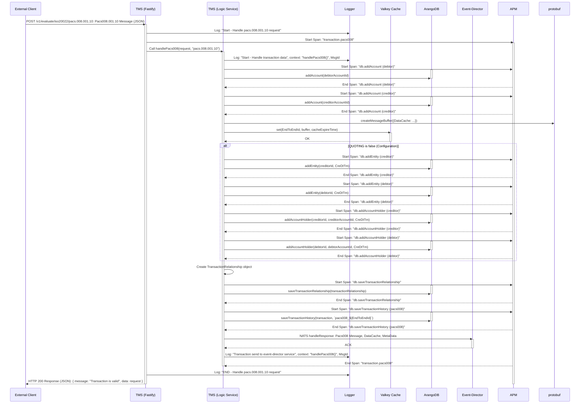

<!--
Documentation research and outputs by LexTego Ltd.
Licensed under the Creative Commons Attribution-ShareAlike 4.0 International License.
See: https://creativecommons.org/licenses/by-sa/4.0/
-->
Analysis:
Okay, based on the provided files, especially the `README.md` and the code snippets from `src/app.controller.ts` and `src/logic.service.ts`, here's a detailed sequence diagram for processing a `pacs.008.001.10` message.  This diagram aims to be more granular than the one in the `README.md` and reflect the code flow more closely.

**Key improvements and details in this diagram:**

*   **Actors are more specific:**  Distinguishes between the Fastify layer (`TMS_Fastify`) and the Logic Service layer (`TMS_Logic`) within the TMS.
*   **APM spans are included:** Shows the start and end of APM spans for transaction and database operations, reflecting the `apm.ts` and code usage.
*   **Cache interaction is detailed:** Shows the `set` operation on Valkey Cache with `createMessageBuffer`.
*   **Conditional Quoting logic:** The `alt` block clearly shows the conditional database operations based on the `QUOTING` configuration.
*   **Database operations are broken down:**  Separate calls to `addAccount`, `addEntity`, `addAccountHolder`, `saveTransactionRelationship`, and `saveTransactionHistory` are shown.
*   **Logger calls are explicitly shown:**  Logging at the start and end of handlers and logic service functions is included.
*   **Event Director interaction:** Shows the NATS `handleResponse` call to the Event Director.
*   **Response to Client:**  Explicitly shows the HTTP 200 response sent back to the client.

This diagram provides a more in-depth view of the `pacs.008.001.10` message processing flow within the TMS service, incorporating the key components and steps involved as derived from the provided code and documentation.
