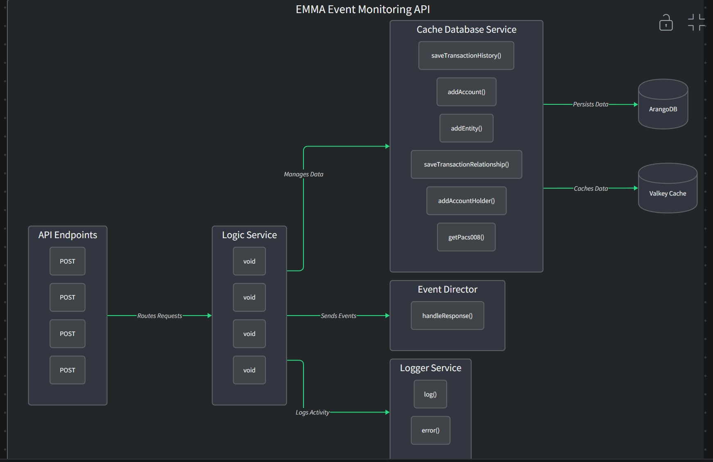

<!--
Documentation research and outputs by LexTego Ltd.
Licensed under the Creative Commons Attribution-ShareAlike 4.0 International License.
See: https://creativecommons.org/licenses/by-sa/4.0/
-->
EMMA Event Monitoring API

```mermaid
API Endpoints
Logic Service
Cache Database Service
Event Director
ArangoDB
Valkey Cache
Logger Service
POST
POST
POST
POST
void
void
void
void
saveTransactionHistory()
addAccount()
addEntity()
saveTransactionRelationship()
addAccountHolder()
getPacs008()
handleResponse()
log()
error()
Routes Requests
Manages Data
Sends Events
Persists Data
Caches Data
Logs Activity
```



